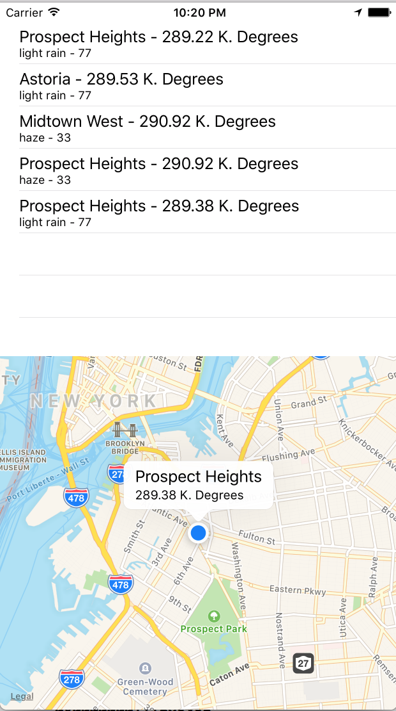

# iOS-Weather-App

This app checks the user's current location and pulls the weather for that
location. Also, it keeps track of the locations the user
has already visited and present them as a historical timeline of places / weather.

